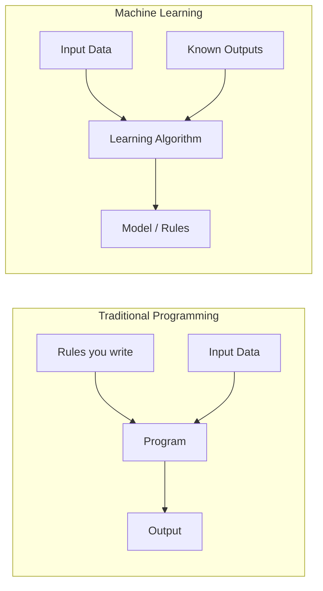

<div align="center">

# What Is Machine Learning, Really?

Md Adnan Hossain Mayaz
mayazcodekage@gmail.com

</div>

---

Every roadmap to machine learning starts the same way: a list of algorithms, a stack of math prerequisites, and a promise that by chapter twelve you'll understand neural networks. Almost none of them stop to answer the one question that actually matters first — **what is machine learning, in a way that doesn't just repeat the word "learning" back at you?**

That's where this series starts. Not with code, not with math, just with a clear picture of what's actually happening when we say a machine "learns."

## The Sentence Everyone Quotes But Rarely Understands

If you've read even one article about ML, you've seen some version of this definition, first written by computer scientist Tom Mitchell in the late 1990s: *a program learns from experience if its performance on a task improves as it gains more experience.*

It sounds simple. It's also easy to nod along to without absorbing what it actually implies — that we are no longer telling the computer **how** to do something. We're telling it **what** success looks like, and letting it figure out the "how" by looking at examples.

That single shift is the entire idea. Everything else — regression, neural networks, transformers, all of it — is just different machinery built on top of that one shift.

## Traditional Programming vs. Machine Learning

Think about how you'd normally build a program to detect spam emails the old-fashioned way. You'd sit down and write rules:

- If the email contains "free money," flag it.
- If the sender is not in the contact list *and* the subject line has three or more exclamation marks, flag it.
- If the email has a suspicious link, flag it.

This works for a while. Then spammers change their wording, and you're back at your desk writing rule #47. This approach doesn't scale, because **you** are the one who has to notice every new pattern and hand-code a fix for it.

Machine learning flips this relationship entirely.



In traditional programming, you supply the rules and the data, and the program produces an output. In machine learning, you supply the data *and* the known outputs, and the algorithm works backward to figure out the rules on its own. Once it has those rules — now called a **model** — you can feed it new, unseen data and it will predict the output for you.

This is why a spam filter built with ML doesn't need a human to keep updating it by hand. It was trained on thousands of emails already labeled "spam" or "not spam," and it learned the underlying patterns — certain word combinations, sender behavior, formatting quirks — well enough to catch new spam it has never seen before.

## Where the Name Actually Came From

The term "machine learning" isn't new marketing language from the last decade. It was coined back in 1959 by Arthur Samuel, an IBM researcher who built a checkers-playing program that literally got better the more it played against itself. Samuel described it, roughly, as giving computers the ability to learn without being explicitly programmed for every situation — a phrase that's still the cleanest one-liner definition floating around today.

For most of the following decades, ML lived quietly inside statistics departments and research labs. It didn't become a household concept until three things lined up around the 2010s: **enormous datasets** became available (thanks to the internet), **cheap computing power** became accessible (thanks to GPUs originally built for video games), and researchers found better ways to train **deep neural networks**. The 2012 ImageNet competition, where a deep learning model called AlexNet dramatically outperformed every traditional approach at recognizing images, is often pointed to as the moment the field's center of gravity shifted from classical statistics toward the deep learning era we're in now.

## The Three Ways a Machine Can "Learn"

Not all machine learning works the same way. Broadly, it splits into three categories, based on what kind of "experience" the algorithm is given.

| Type | How It Learns | Real-World Example |
|---|---|---|
| **Supervised Learning** | Learns from labeled examples — input paired with the correct answer | Email spam detection, house price prediction |
| **Unsupervised Learning** | Finds patterns in data that has *no* labels at all | Customer segmentation, anomaly detection in transactions |
| **Reinforcement Learning** | Learns by trial and error, receiving rewards or penalties for actions | Game-playing agents, robotics, self-driving policy decisions |

Most of what you'll read about in the early parts of any ML roadmap — including this one — falls under *supervised learning*, simply because it's the most intuitive starting point: you already know the "right answers," so you can measure exactly how wrong the model is and correct it.

## A Tiny, Honest Example

You don't need a GPU cluster to see this idea in action. Here's a genuinely small example using `scikit-learn`, one of the most widely used ML libraries in Python, to predict a simple pattern from a handful of data points.

```python
from sklearn.linear_model import LinearRegression
import numpy as np

# "Experience" - hours studied vs exam score
hours_studied = np.array([[1], [2], [3], [4], [5]])
exam_score = np.array([50, 55, 65, 70, 80])

# The model learns the relationship on its own
model = LinearRegression()
model.fit(hours_studied, exam_score)

# Now predict for a value it has never seen
predicted_score = model.predict([[6]])
print(f"Predicted score for 6 hours of study: {predicted_score[0]:.2f}")
```

Nobody told this program that studying more tends to raise exam scores. It looked at five examples, found the underlying trend on its own, and used that trend to make a prediction about a new, unseen input. That's the entire idea of machine learning, just at the smallest possible scale. Everything you'll learn later in this series — gradient descent, loss functions, neural networks — exists to do this same basic thing, just for problems far messier than five data points.

## What Machine Learning Is *Not*

It's worth being direct about a few misconceptions, because they cause real confusion down the line:

- ML is **not** the same as artificial intelligence — it's one *approach* to building AI, not the whole field.
- A trained model is **not** "thinking" in any conscious sense. It's applying a mathematical function it learned from data.
- More data does **not** automatically mean a better model — quality, relevance, and how the data was collected usually matter more than raw volume.
- ML is **not** magic that removes the need for human judgment — someone still decides what data to use, what "success" means, and whether the model's mistakes are acceptable.

## Why This Matters Before You Touch a Single Algorithm

If you skip this foundation and jump straight into memorizing how a decision tree splits nodes or how backpropagation adjusts weights, you'll be learning mechanics without understanding *why* those mechanics exist. Every algorithm in machine learning is just a different strategy for solving the same underlying problem: given data and a target, find a function that generalizes well to new, unseen inputs. Keep that one sentence in your head, and the rest of this roadmap will make a lot more sense as it gets more technical.


If you want to go deeper into the formal definition this post is built on, Tom Mitchell's original framing is laid out in his textbook *[Machine Learning](https://www.cs.cmu.edu/~tom/mlbook.html)* (1997), still referenced in most university courses today.
